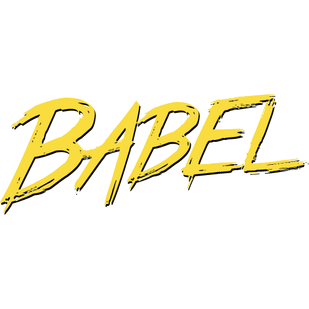

# About Me

### `Ui/Ux Designer & Developer `

- 👋 Hi, I’m @premkumar
- 👀 I’m interested in ... full stack Web development
- 💞️ I’m looking to do more open source contributions
- 📫 How to reach me ... @premenaga@gmail.com

---

## Find me around the web 🌍

  
 

---

## My skills 🚀

---

   

 

---

<!---
premshetty/premshetty is a ✨ special ✨ repository because its `README.md` (this file) appears on your GitHub profile.
You can click the Preview link to take a look at your changes.
--->
